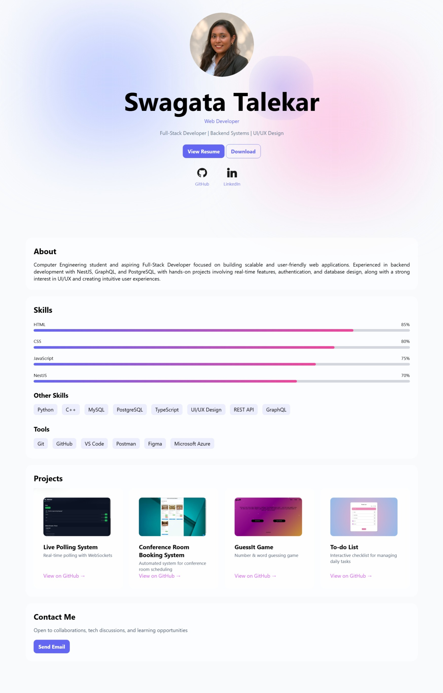

# 🌐 Personal Portfolio

A modern, responsive personal portfolio website showcasing my projects, skills, and experience as a Full-Stack Developer.

🔗 Live Website: https://Swagata029.github.io/Portfolio/

---

## 👋 About Me

I’m a Computer Engineering student and aspiring Full-Stack Developer focused on building scalable and user-friendly web applications. I have experience in backend development using NestJS, GraphQL, and PostgreSQL, along with a strong interest in UI/UX and intuitive design.

---

## 🚀 Features

- ✨ Modern UI with glassmorphism design  
- 🎯 Smooth scroll animations  
- 📊 Animated skill bars  
- 🔮 Interactive cursor glow effect  
- 📱 Fully responsive layout  
- 🔗 Direct links to projects, GitHub, and LinkedIn  

---

## 📂 Sections

- Hero (Introduction + Tagline)  
- About Me  
- Skills (Core + Tools)  
- Projects  
- Contact  

---

## 📸 Preview

---

## 🔗 Connect with Me

- 💼 LinkedIn: https://www.linkedin.com/in/swagata-talekar  
- 💻 GitHub: https://github.com/Swagata029  
- 📧 Email: talekarswagata2629@gmail.com  
